# ccc
A solution for understanding **C**oordinates, across **C**heckpoints and **C**omponents, in a neural network, via (**Tri**)**C**lustering and beyond. 


We provide various visualization routines, and importantly, an interesting way to identify **component groups** and **outlier coordinates** in a model, and track the trajectory of training. 

The code was originally developed as a monitoring and analysis tool (especially, for certain **mechanistic interpretability** purposes, as well as efforts to **train networks that will be mechanistically interpretable**) for neural network architectures in which a persistent notion of 'coordinate' throughout the network *might* exist (we will write on this matter in a separate repository). However, aside from the pursuit of a notion of coordinates, the application of this tool to Transformers (in which MLPs might 'mix up' the coordinates) could still provide useful insights and questions. We elaborate on some use cases for this analysis (via `ccc`) in a later section.


In summary, we provide 
- a way of summarizing neural networks weights, into a 3-dimensional tensor (the 'CCC data');  
- a clusteredness model for this data; which is put to test, against other clustering approaches, using a scoring system:
- a score, aiming for distinguishing the more informative classifications (for training, inference, hyperparameter tuning, model compression, model merging, etc.)
- various visualizations, as well as a long list of experiments (a few hundred), comparing the component groupings and outlier coordinates identified by different methods (clustering and others). 


We encourage tweaking the code, especially the classification approaches and parameters, based on specific monitoring goals. The interdependencies within the code are summarized below. 

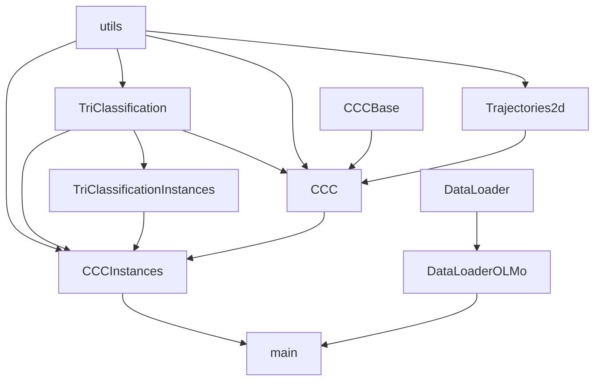
```mermaid
graph TD;
    utils-->Trajectories2d;
    utils-->TriClassification;
    TriClassification-->CCC;
    utils-->CCC;
    utils-->CCCInstances;
    CCCBase-->CCC;
    Trajectories2d-->CCC;
    TriClassification-->TriClassificationInstances;
    TriClassification-->CCCInstances;
    TriClassificationInstances-->CCCInstances;
    CCC-->CCCInstances;
    CCCInstances-->main;
    DataLoader-->DataLoaderOLMo;
    DataLoaderOLMo-->main;
```


## Usage

Data loaders for the [Pythia suite](https://github.com/EleutherAI/pythia) and the [OLMo suite](https://github.com/allenai/OLMo), for which checkpoint data is publicly available, are included in this repository. Therefore, the experiments for Pythia and OLMo can be run, in Python 3.10+, to generate the plots, using 
```
python main.py
```

For other decoder-only transformer models, `DataLoaderTransformerDecoder` can be subclassed, and for general architectures, subclass `DataLoaderBase`. Then, these classes can be called from within `main.py`. 

# A Demo, for `OLMo-1B`

Let us consider as an example the model `OLMo-1B` from the [OLMo](https://github.com/allenai/OLMo) suite, a decoder-only transformer, for which 335 training checkpoints are available and, $n_{coord}\coloneqq 2048$, $n_{layer} \coloneqq 16$, and $n_{head} \coloneqq 16$. We consider the checkpoints at steps divisible by $10^4$, hence 50 steps: 20k-110k and 330k-730k, except for 670k. Note that each step is a ~5GB download from HuggingFace. Overall, by employing various clustering approaches as well as some other identification approaches, we run 301 experiments (obtained via `python main.py`), generating 301 plots some of which are showcased below. 

Similar analysis could be run for any model for which training checkpoints are available; e.g., for [LLM360](https://arxiv.org/pdf/2312.06550.pdf), for [Pythia](https://github.com/EleutherAI/pythia) models, or for privately-trained models; see some of such plots at the end of this note. 

## The 3-dimensional Data

We consider the following *components*: 
- Q, K, V, and O, matrices for all heads in all layers, hence a total of $4 \times 16 \times 16 = 1024$ matrices;
- two MLP matrices in each layer, hence a total of $2 \times 16=32$ matrices;  
- an embedding matrix. 

This is a total of $n_{comp}\coloneqq 1057$ matrices for each checkpoint. Note that each of these matrices have a dimension of size $n_{coord} = 2048$. Possibly after transposition, assume that their 0-th dimension is of this size. 
For each of these matrices, **summarize** each row into a single number (e.g., by computing the squared $\ell_2$ norm; see `fun2d` in `DataLoaderTransformerDecoder` class) to get a $n_{coord}$-dimensional vector. This process creates a $(n_{coord}\times n_{ckpt} \times n_{comp})$-dimensional tensor.  

The above process is implemented as the `DataLoader` classes. 
Data loaders for the [Pythia suite](https://github.com/EleutherAI/pythia) and the [OLMo suite](https://github.com/allenai/OLMo) are included in this repository. 
For other decoder-only transformer models, `DataLoaderTransformerDecoder` can be subclassed, and for general architectures, subclass `DataLoaderBase`.

## The Clustering Model
Based on empirical observations for certain neural architectures, we consider the following clustering model: 
- dividing coordinates into two groups; namely, inliers and outliers (after plotting, it will become apparent why we call these inliers and outliers. For some other notions of an outlier coordinate, e.g., see [LLM.int8()](https://arxiv.org/abs/2208.07339), and this article on [Privileged Bases]([#ref-ELO23](https://transformer-circuits.pub/2023/privileged-basis/index.html)))

- dividing components into three groups, where the third group is to be discarded in subsequent computations.

In using this model for clustering, we could rely on biclustering for specific checkpoints, and possibly combine the clustering results, or use triclustering approaches. We have implemented various methods, both based on this model and generic clustering approaches, in the `TriClassification` and `Trajectories2d` classes. 

## The 2-D Trajectories

Given the outputs of the clustering (see class `Groups`), namely two disjoint subsets of the coordinates and two subsets of the components, we can then generate plots similar to the following, via
- first splitting the 3-dimensional tensor into two tensors, based on the two components groups,
- aggregating each of these two  3-dimensional tensors into a 2-dimensional matrix, say by applying a (weighted) summation along the 'components' dimension,
- then, using these two matrices as x and y values (possibly their logarithm), to create a trajectory (across checkpoints) for each coordinate.

<p align="center">
    
</p>

In the above, 
- the top-left subplot depicts the *inlier* trajectories (where the 'mean' trajectory is in a gradient-red color); 
- the top-right depicts the *outlier* trajectories where the black rectangle is the bounding box of the top-left subplot and the mean trajectory from the top-left subplot is also depicted; 
- the bottom-right subplot depicts the grouping of the components, where columns (in rows where it's applicable) correspond to the layers; 
    - those marked in blue belong to the first group and contribute to the horizontal axis in the top-row subplots, 
    - those marked in red belong to the second group and contribute to the vertical axis in the top-row subplots. 
    - those marked by an 'x' belong to the third group and are discarded. 
    - green corresponds to components belonging to both groups (no such component in this plot). 
- The bottom-left subplot is a quiver plot (with some averaging and modifications) for the inlier trajectories. 

Note that the 'elbow' in the above is rather superficial; the `OLMo-1B` checkpoints jump from ~110k to ~330k. However, such turning points can be present for models with equispaced checkpoints, as seen from the examples at the end of this note. 

Here are a couple more examples:

<p align="center">


</p>

Each of the above plots are the result of a specific component grouping and outlier identification approach (a specific instance of `Group`) and have low 'scores' (defined later). 
Compare the above plots with the following ones in which components have been assigned to the two groups at *random* (where the generated plot have a high 'score'): 

<p align="center">
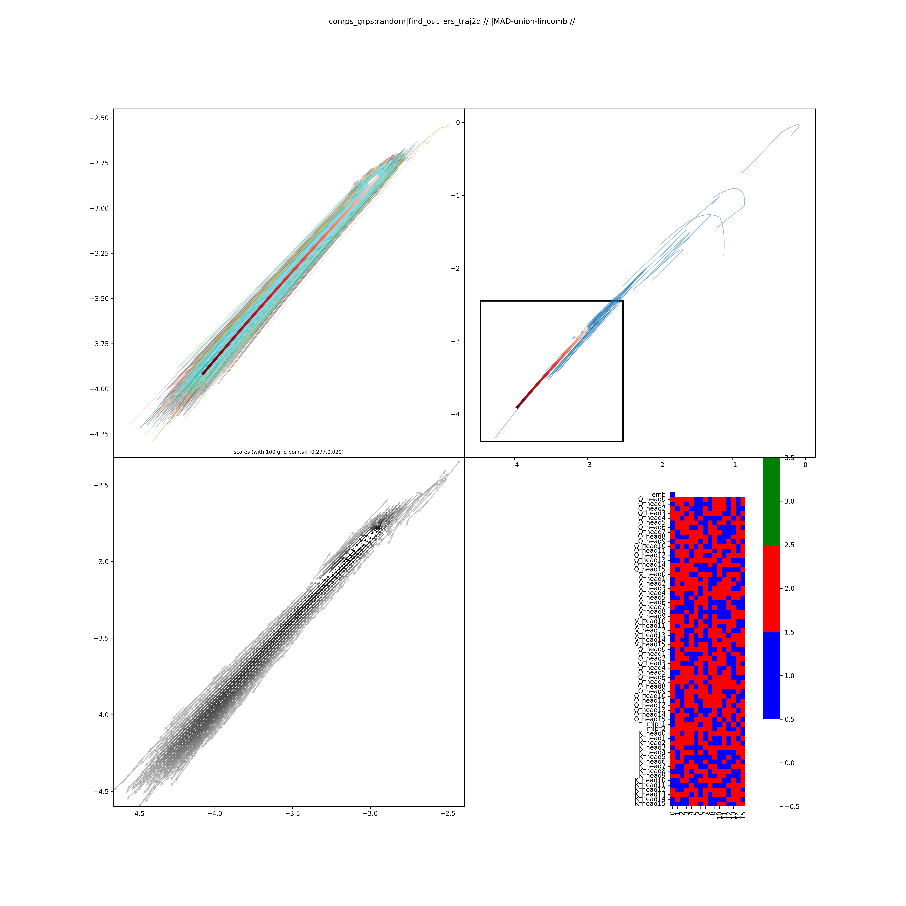
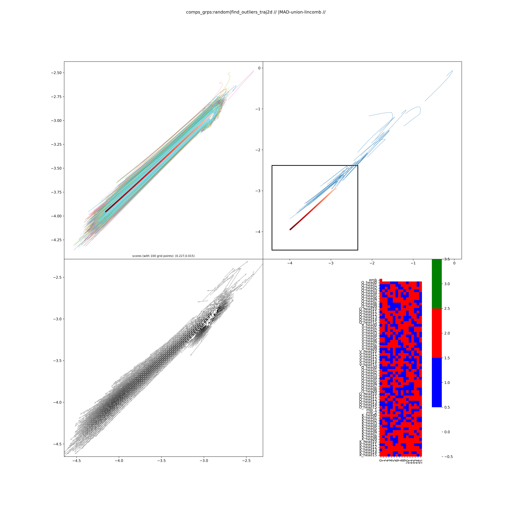
</p>

The following plot has `emb` in one group and all other components in the other; 

<p align="center">
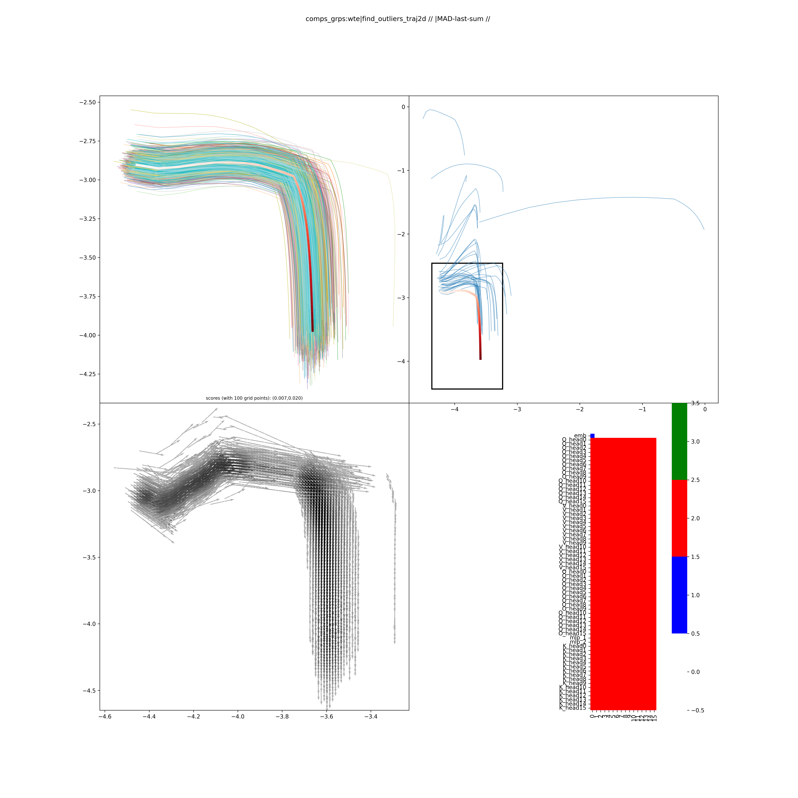
</p>

## 1-D Trajectories?
To observe the importance of two-dimensional plotting, and more specifically the aforementioned 'clustering model' that there exists two types of components, consider the following 1-dimensional plot, in which we aggregate all components (instead of aggregating within each of the two groups of components).  
<p align="center">
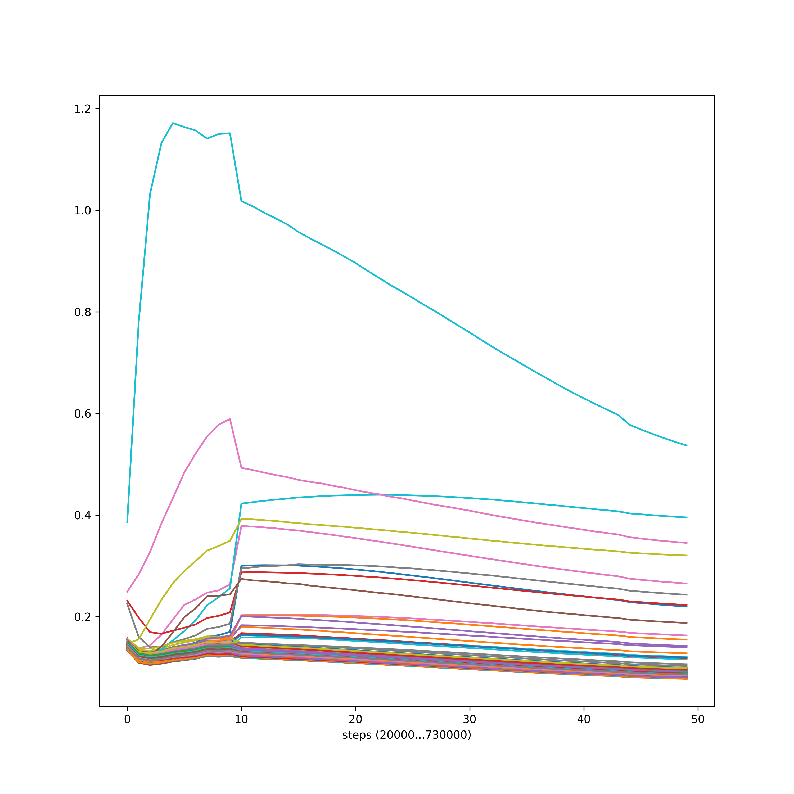
</p>

While some coordinate trajectories could be identified as outliers based on this plot, a lot more information could be gleaned from the 2-D plots; see the subsequent discussions. This also suggests that more elaborate analysis of the 3d tensor created here might lead to further useful insight.

## Scoring the 2-D Trajectories

Each clustering result (inlier/outlier coordinates, component groups) leads to a 2-D trajectories plot as above. Given such a plot, we can define a pair of scores, measuring 
1. the 'irregularity' of the 'inlier' subset of the trajectories (the lower the better), and,
1. the 'fraction' of left out trajectories (outliers; the fewer the better).

Note how the two scores are inversely correlated when the component groups are fixed.  

This creates a score (a pair of numbers) for each clustering result, which could serve several purposes; e.g.,  
- for *finding* clusterings that lead to 2-D trajectories with minimal scores, as an alternative to tensor clustering. We experimented with a few 'set optimization' algorithms but leave an effective implementation to future work.
- for validating 'models' for the clusteredness properties of our data. 
Interestingly, we find that the groupings and outlier sets identified through the aforementioned tensor clustering methods have low scores (i.e., aside from *a few* outlier coordinates, the other coordinate trajectories are rather *regular*) compared to random groupings or ad-hoc approaches, which **serves as support for our 'clusteredness model' of the data.** Here is a plot of the scores for the 301 experiments (that could be divided into 6 types): 

<p align="center">
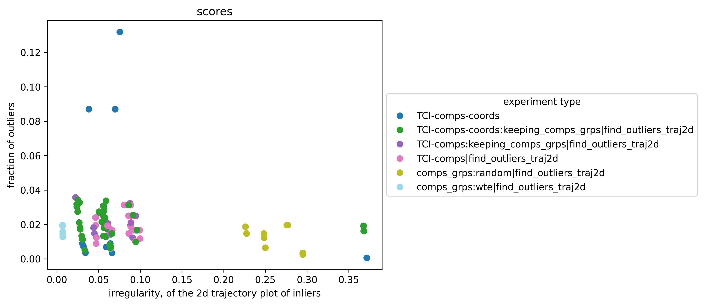
</p>

As yet another examination of the clusteredness of the 3-d tensor, we can compare the component grouping and coordinate grouping across the 301 experiments:

<p align="center">
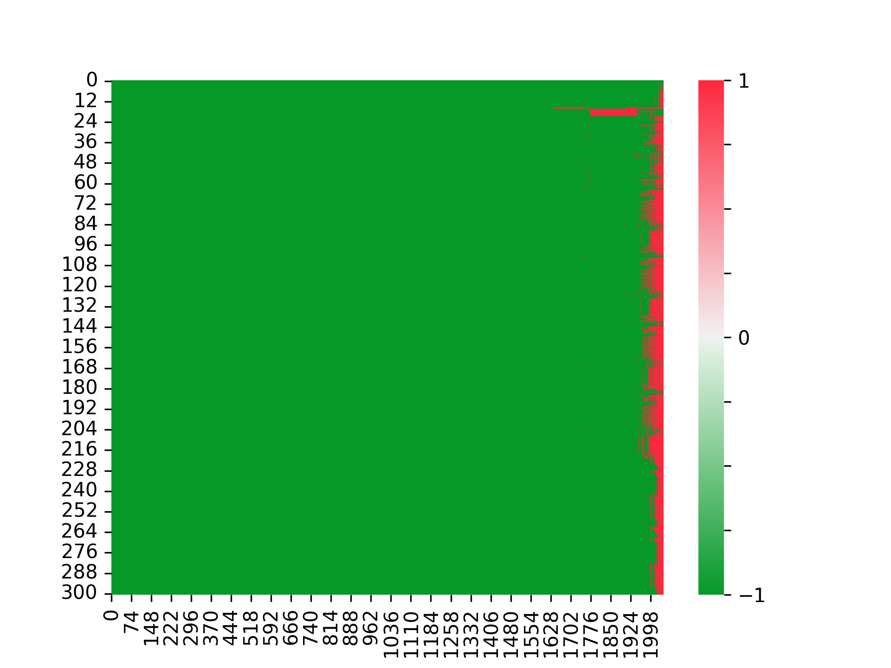
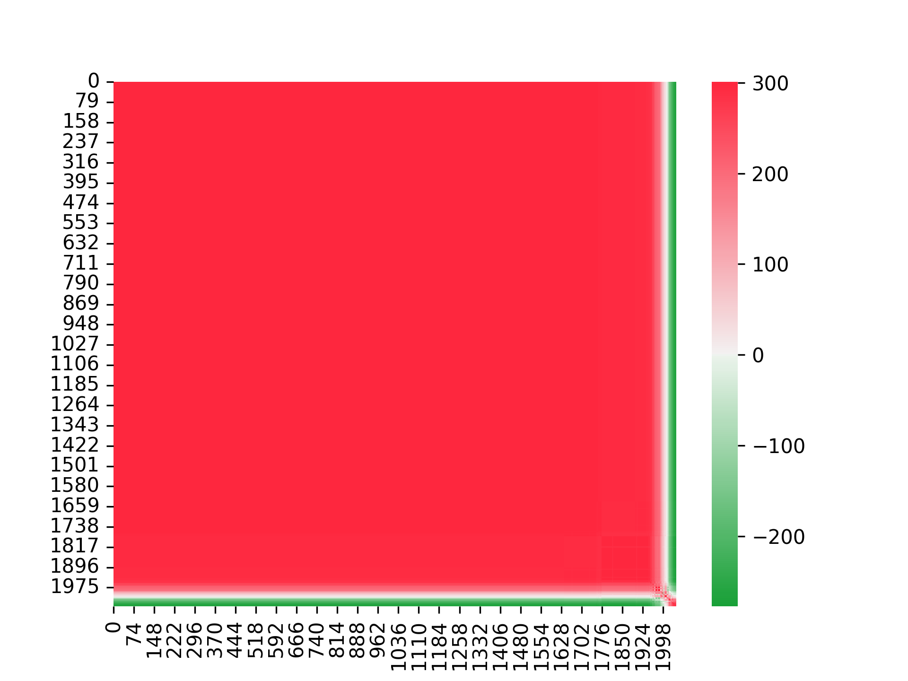
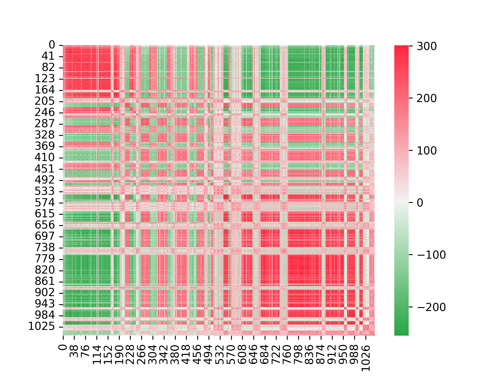
</p>
Each row in the left plot corresponds to one experiment and depicts the $\pm 1$ vector for inlier/outliers in said experiment. 
The plot in the middle is simply the Gram matrix for the previous one. 
The plot on the right is the Gram matrix for the $\pm 1$ indictor vectors for the two identified 'components' in the corresponding experiment.  


## How could these classification and plots be useful?
As mentioned above, we developed this code as an analysis tool in the context of mechanistic interpretability, and eventually, design of new architectures and training methods. The information out of these plots are at times helpful with 
- training (e.g., choosing the ['parameter groups'](https://pytorch.org/docs/stable/optim.html#per-parameter-options) for the optimizer), 
- inference (e.g., along the same lines as [LLM.int8()](https://arxiv.org/abs/2208.07339)),  
- hyperparameter tuning (e.g., aiming for altering the trajectories), 
- model compression; in pruning or quantization (e.g., [LLM.int8()](https://arxiv.org/abs/2208.07339) again), 
- [model merging](https://huggingface.co/collections/osanseviero/model-merging-65097893623330a3a51ead66) (also see [mergekit](https://github.com/arcee-ai/mergekit)); by highlighting components and coordinates for which merging should be done by care or simply as a guide for choosing the components and coordinates for a specific merge operation; e.g., see the 3-step recipe in [TIES-Merging](https://arxiv.org/pdf/2306.01708.pdf); consider improving the random choices in [DARE](https://arxiv.org/pdf/2311.03099.pdf); consider choosing the cutoff on checkpoints in [LAtest Weight Averaging (LAWA)](https://arxiv.org/pdf/2209.14981.pdf) based on the elbows in these plots; choosing the depth cutoff in [Depth Up-Scaling](https://arxiv.org/pdf/2312.15166.pdf); 
- model regular-ization; as in aiming for trained models with a more 'uniform' look across coordinates, checkpoints, and components; e.g., consider the use in model merging or see the rationale in [DoRA](https://arxiv.org/pdf/2402.09353.pdf); also see some of the plots below;

and possibly more.  

Our initial focus was not on the [original Transformers](https://arxiv.org/abs/1706.03762), for which a persistent notion of a 'coordinate' *might* not be well-defined (due to the MLPs). However, applying this tool on Transformers (as in the figures above for OLMo, but also Pythia and a few other private models) seem to produce some insight, and at the very least, some questions; e.g., 
- could these trajectories help design "regularization" strategies to prevent the trajectories to be classified as outliers? or maybe the outlier trajectories are a feature and not a bug?
- could the presence of many outlier coordinates hint on a need for a larger embedding dimension?
- could the inlier coordinates be replaced with fewer number of coordinates?

and more. 

We especially hope that these plots could lead to *adaptive* techniques; i.e., be used *in interaction with the training logs* which are becoming increasingly available, such as in the cases of [OLMo](https://github.com/allenai/OLMo), [LLM360](https://arxiv.org/pdf/2312.06550.pdf), and others.

# To Do:

- add the reports for models with a persistent notion of a 'coordinate'

- effective summarization of all experiments 

- trajectory clustering

- redoing the analysis on subsets of (say, early or late) checkpoints, or subsets of components, and merging the outputs; a hierarchical application of our technique

- run the ccc analysis for other models whose checkpoints are available, beyond [Pythia](https://github.com/EleutherAI/pythia) and [OLMo](https://github.com/allenai/OLMo); e.g., see Table 1 in [LLM360](https://arxiv.org/pdf/2312.06550.pdf) for a recent list. 

- run the ccc analysis for models with adapters 

# Plots for some other models

See `assets` for other types of plots for these experiments. 

## `OLMo-1B` in 'compact' mode (7 components)

<p align="center">
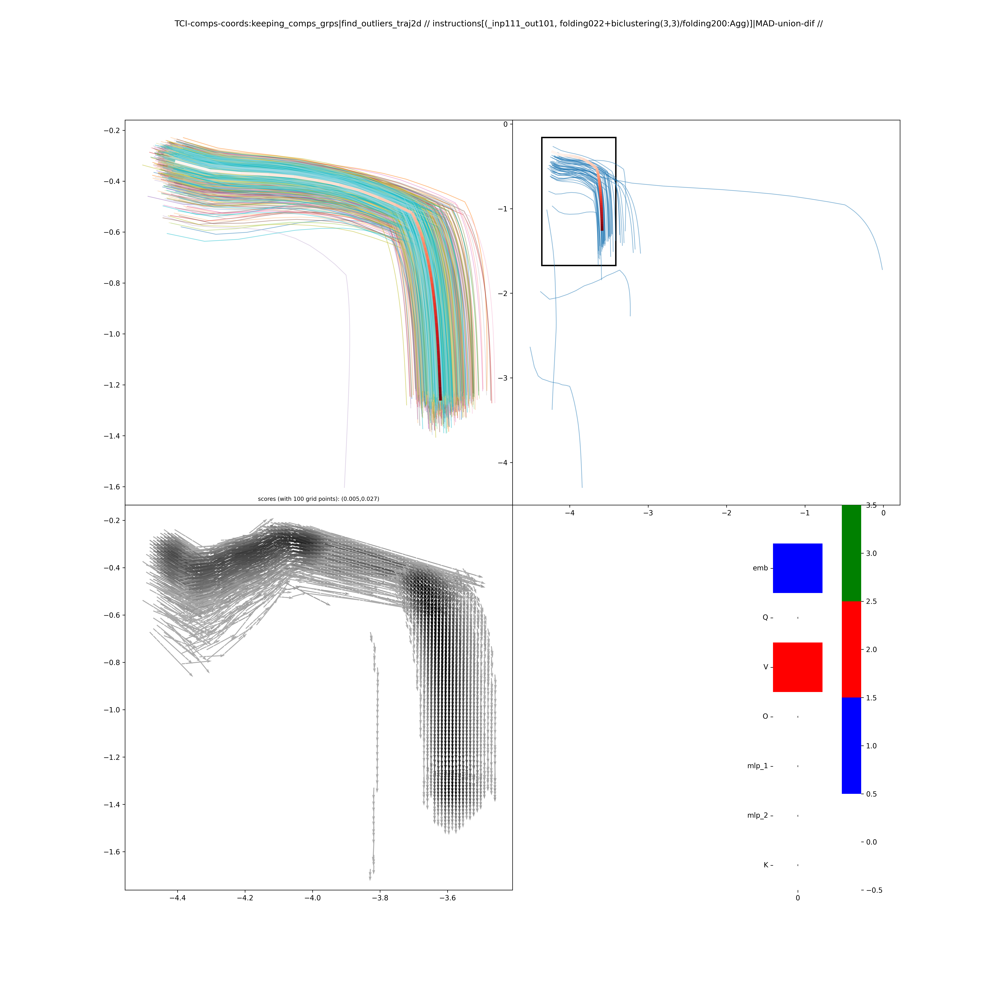


</p>


## A variant of `codeparrot` in `compact` mode

<p align="center">


</p>

## A modified decoder-only transformer

<p align="center">
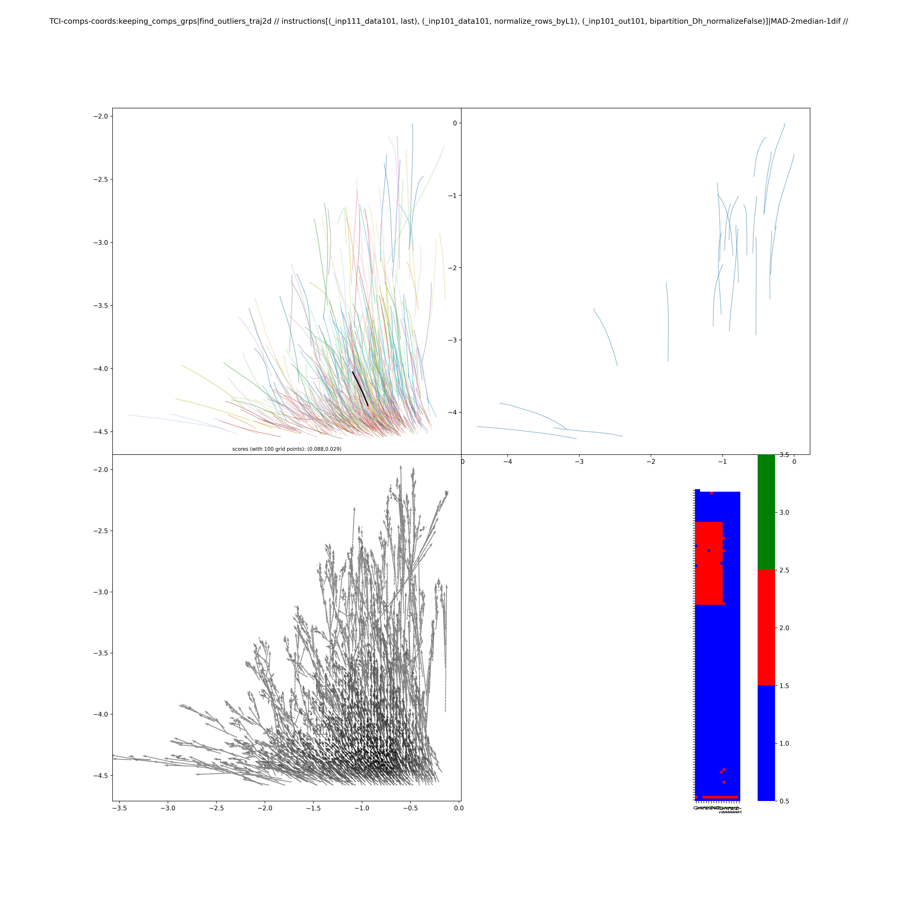
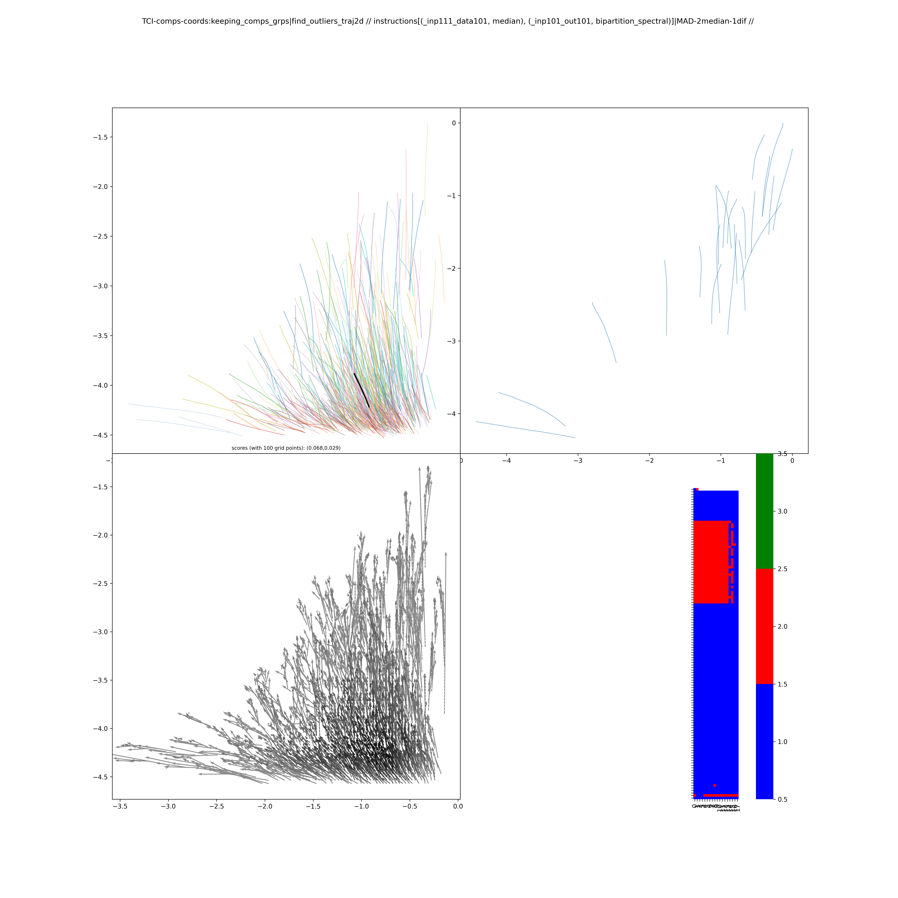

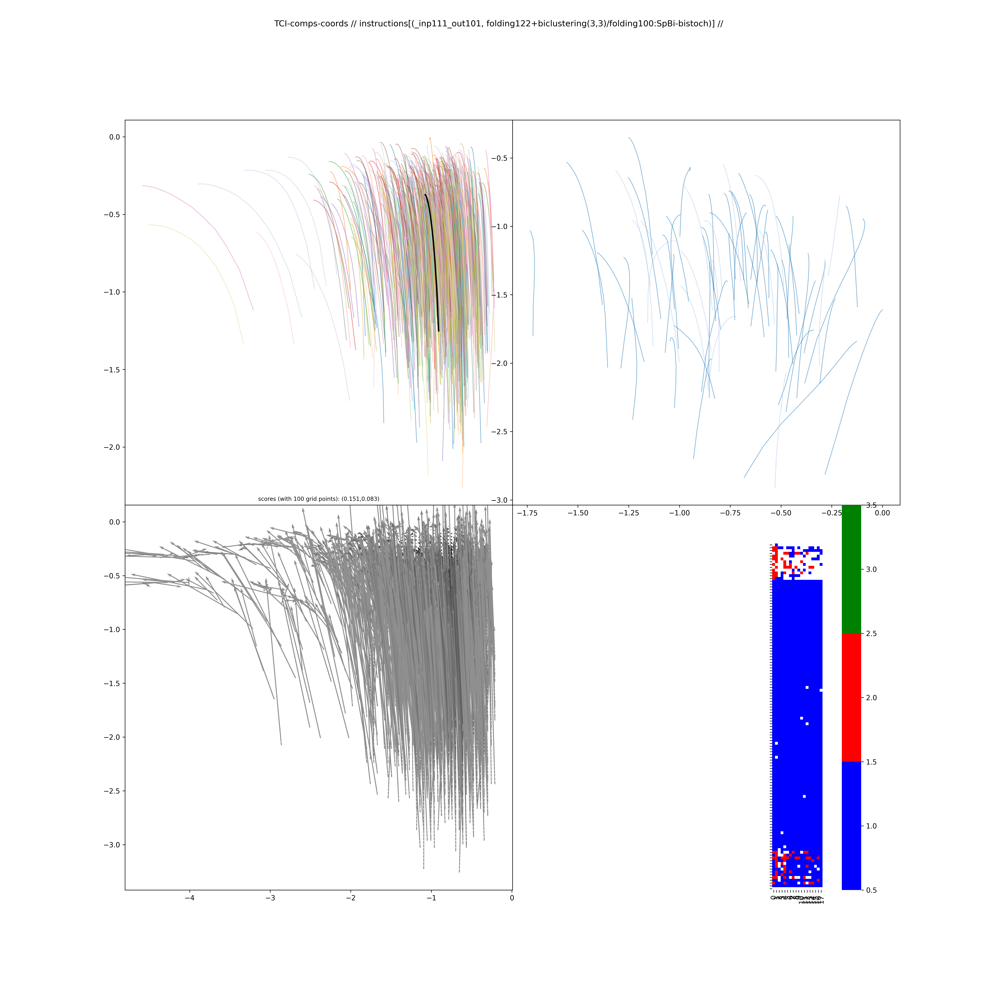


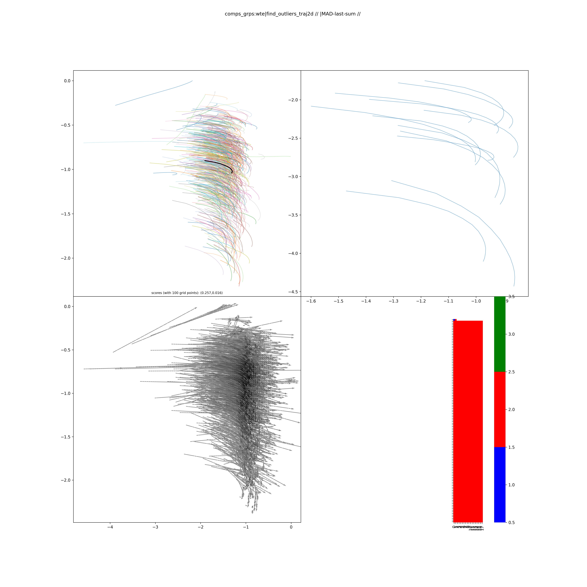
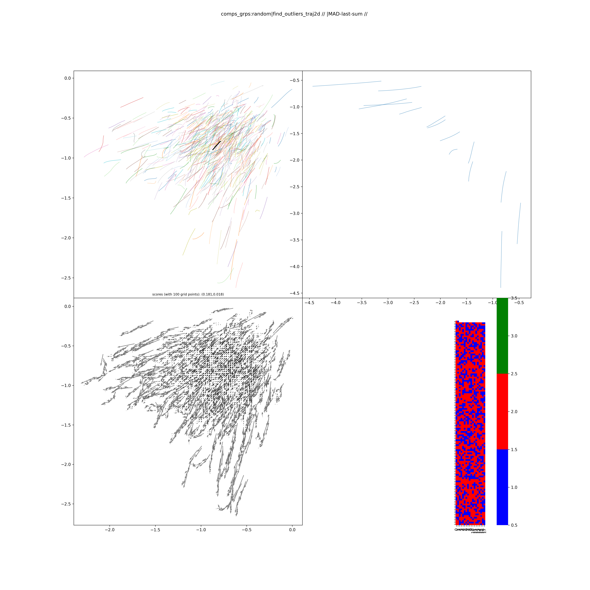
</p>


